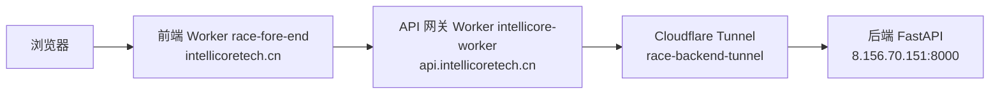

# 涉农信贷风控系统 · 竞赛前端（fore-end）

> 挑战杯创业计划竞赛（东北振兴产业升级专项赛）· 数智赋能产业组
> 面向用户的演示前端：数据录入 → 信用评估 → 结果展示，配套数据看板与团队介绍
> 版本：Demo v1.4

## 技术栈

Vue 3.5（`<script setup>` SFC）+ TypeScript 6 + Vite 8 + Element Plus + Pinia + Vue Router（Hash 路由）+ ECharts + Axios + Sass

## 功能页面

| 路由 | 页面 | 说明 | 权限 |
|---|---|---|---|
| `/home` | 项目介绍 | 系统与「四大维度 15 项替代数据指标」体系介绍 | 公开 |
| `/login` | 登录 | 邀约制登录（无注册，账号由后台管理平台开通） | 公开 |
| `/input` | 数据录入 | 15 项指标表单（土地经营/农业补贴/农业保险/产销经营），信贷员 3 分钟完成录入 | 需登录 |
| `/result` | 评估结果 | 信用评分仪表盘（0-1000）· 风险等级 · 违约概率 · 授信建议 · 各指标贡献 · 前三项扣分原因 · 打印报告 | 需登录 |
| `/dashboard` | 数据看板 | 评分分布 / 评估趋势 / 行业分布等统计图表 | 需登录 |
| `/team` | 团队介绍 | 团队成员展示 | 公开 |

所有页面均做了移动端适配（<768px 抽屉菜单、表单标签置顶、图表横向滑动等）。

## 本地启动

```bash
cd fore-end
npm install
npm run dev        # http://localhost:5174，/api 代理到 localhost:8000
```

环境变量：

| 文件 | 值 | 说明 |
|---|---|---|
| `.env.development` | `VITE_API_BASE_URL=/api/v1` | 开发走 Vite 代理（vite.config.ts 代理到 :8000） |
| `.env.production` | `VITE_API_BASE_URL=https://api.intellicoretech.cn/api/v1` | 生产经 API 网关访问后端 |

## 与后端契约

- 接口封装：`src/api/`（`auth.ts` 登录、`risk.ts` 评估、`types.ts` 类型契约）
- 15 项指标类型与四大维度分类：`src/api/types.ts`（`RiskInput` / `CATEGORIES`）
- 登录态：`src/stores/auth.ts`（token 存 `race_token`，401 自动清理并跳登录）
- 评估表单状态：`src/stores/risk.ts`
- 路由守卫：`src/router/index.ts`（`/input` `/result` `/dashboard` 需登录）

## 资料文档（docs/）

核心业务数据源，随仓库版本管理：

| 文件 | 说明 |
|---|---|
| `docs/《农业及相关产业统计分类（2020）》.docx` | 官方分类表原始文件（大类/中类/小类 + 行业代码） |
| `docs/《农业及相关产业统计分类（2020）》.md` | 分类表纯文本版（403 行，与 docx 逐条一致） |
| `docs/农业及相关产业动态指标搜集体系.xlsx` | 东北振兴版分层动态指标搜集体系（775 行 × 14 列） |
| `docs/农业及相关产业动态指标搜集体系.md` | 指标体系文本版（与 xlsx 逐条一致） |

> 一致性校验：docx ↔ 分类表 md、xlsx ↔ 指标体系 md 已全量核对一致（代码、名称、说明、行业代码、层级归属均无差异）。

## 质量检查

```bash
npm run lint          # eslint . --max-warnings=0
npm run format        # prettier --write src/**
npm run format:check  # prettier --check src/**
npm run build         # vue-tsc + vite 构建验证
```

## 部署架构

前端通过 **Cloudflare Workers** 部署（非 Pages），推送到 `main` 分支自动构建上线。



- 前端静态站：Worker `race-fore-end`，自定义域名 `intellicoretech.cn`，git 集成自动部署
- API 网关：Worker `intellicore-worker`，路由 `api.intellicoretech.cn/*`，将请求代理到 `backend.intellicoretech.cn`
- 后端隧道：`race-backend-tunnel`（backend.intellicoretech.cn → 后端 :8000）
- 网关源码存档：`cloudflare/intellicore-worker/`（worker.js / metadata.json / wrangler.jsonc）

### 本地部署步骤（若需手动）

1. `npm run build` 生成 `dist`
2. 上传到 `race-fore-end` Worker（静态资源 Worker，或用 wrangler `[assets]`）
3. 生产 API 地址在 `.env.production` 中配置，无需手动改
4. 部署后访问 https://intellicoretech.cn
