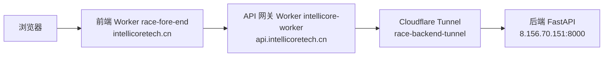

# 涉农信贷风控系统 · 竞赛前端（fore-end）

> 挑战杯创业计划竞赛（东北振兴产业升级专项赛）· 数智赋能产业组
> 面向用户的演示前端：数据录入 → 信用评估 → 结果展示，配套数据看板与团队介绍
> 版本：Demo v1.9

## 技术栈

Vue 3.5（`<script setup>` SFC）+ TypeScript 6 + Vite 8 + Element Plus + Pinia + Vue Router（Hash 路由）+ ECharts + Axios + Sass

## 功能页面

| 路由 | 页面 | 说明 | 权限 |
|---|---|---|---|
| `/home` | 项目介绍 | 系统与「分层动态指标体系 + 专家引擎」体系介绍 | 公开 |
| `/login` | 登录 | 邀约制登录（无注册，账号由后台管理平台开通）+ go-captcha 行为验证码 | 公开 |
| `/input` | 数据录入 | 勾选具体营业类型自动加载指标体系（基本项 + 大类→中类→小类→具体营业类型），信贷员快速完成录入 | 需登录 |
| `/result` | 评估结果 | 信用评分仪表盘（0-1000）· 风险等级 · 违约概率 · 授信建议 · 各指标贡献 · 前三项扣分原因 · 历史评估记录 · 打印报告 | 需登录 |
| `/dashboard` | 数据看板 | 评分分布 / 评估趋势 / 行业分布等统计图表 | 需登录 |
| `/team` | 团队介绍 | 团队成员展示 | 公开 |

所有页面均做了移动端适配（<768px 抽屉菜单、表单标签置顶、图表横向滑动等）。

## 项目结构

```
fore-end/
├── src/
│   ├── api/          # 接口封装（auth / captcha / risk / indicator / dashboard / index）
│   │   └── index.ts  # axios 实例：自动分流、JWT、信封解包、401 统一处理
│   ├── components/   # 通用组件（DynamicField / MixedRatioSlider / RiskBadge / ScoreGauge / StatCard）
│   ├── layouts/      # 应用布局（AppLayout：侧边栏 + 抽屉 + 顶栏）
│   ├── router/       # 路由（懒加载 + chunk 失效自动刷新 + 登录守卫 + 导航菜单 NAV_MENUS）
│   ├── stores/       # Pinia（auth 登录态 / risk 评估结果与表单）
│   ├── utils/        # 工具（validateIndicator 指标校验）
│   ├── views/        # 页面（Home / Login / DataInput / Result / Dashboard / Team）
│   ├── constants.ts  # 全局常量（应用名 / 版本号 / 存储键，统一维护）
│   ├── styles/       # 全局样式（Element Plus 主题色覆盖 + 通用类）
│   └── main.ts       # 入口：恢复会话后再挂载路由
├── docs/             # 业务与模型文档（见下表）
├── cloudflare/       # API 网关 Worker 源码存档
└── public/           # 静态资源
```

架构说明见 `docs/前端架构说明.md`。

## 本地启动

```bash
cd fore-end
npm install
npm run dev        # http://localhost:5174，/api 代理到 localhost:8000
```

环境变量：

| 文件 | 值 | 说明 |
|---|---|---|
| `.env.development` | `VITE_API_BASE_URL=/api/v1` | 开发走 Vite 代理（vite.config.ts 代理到 :8000） |
| `.env.production` | （已注释） | 生产**按域名运行时分流**：`src/api/index.ts` 依据 `hostname` 自动选择主站 `/api/v1` 或 dev 预览 `/dev/api/v1`，无需环境变量 |

## 与后端契约

- 接口封装：`src/api/`（`auth.ts` 登录、`risk.ts` 动态评估与历史记录、`indicator.ts` 指标树、`types.ts` 类型契约）
- 动态指标体系：勾选具体营业类型后由后端 `/indicators/tree` 加载（基本项 + 大类→中类→小类→具体营业类型）
- 登录态：`src/stores/auth.ts`（token 存 `race_token`，401 自动清理并跳登录）
- 评估表单状态：`src/stores/risk.ts`
- 路由守卫：`src/router/index.ts`（`/input` `/result` `/dashboard` 需登录；懒加载 chunk 失效自动刷新）

## 资料文档（docs/）

核心业务数据源，随仓库版本管理：

| 文件 | 说明 |
|---|---|
| `docs/《农业及相关产业统计分类（2020）》.docx` | 官方分类表原始文件（大类/中类/小类 + 行业代码） |
| `docs/《农业及相关产业统计分类（2020）》.md` | 分类表纯文本版（403 行，与 docx 逐条一致） |
| `docs/农业及相关产业动态指标搜集体系.xlsx` | 东北振兴版分层动态指标搜集体系（3020 行 × 14 列） |
| `docs/农业及相关产业动态指标搜集体系.md` | 指标体系文本版（与 xlsx 逐条一致） |
| `docs/涉农信贷风控模型说明.md` | 模型说明：指标判断、专家引擎、评分卡训练流程、评估指标、双引擎混合决策 |
| `docs/涉农信贷风控模型全流程说明.md` | 模型全流程说明（版本演进 + 数学公式，供数学组/答辩） |
| `docs/前端架构说明.md` | 前端架构：分层结构、请求链路、状态管理、路由与部署说明 |

> 一致性校验：docx ↔ 分类表 md、xlsx ↔ 指标体系 md 已全量核对一致（代码、名称、说明、行业代码、层级归属均无差异）。

## 质量检查

```bash
npm run typecheck     # vue-tsc 类型检查
npm run lint          # eslint . --max-warnings=0
npm run format        # prettier --write（统一 LF 行尾）
npm run format:check  # prettier --check
npm run build         # vue-tsc + vite 构建验证
```

## 部署架构

前端通过 **Cloudflare Workers** 部署（非 Pages），推送到 `main` 分支自动构建上线。



- 前端静态站：Worker `race-fore-end`，自定义域名 `intellicoretech.cn`，git 集成自动部署
- API 网关：Worker `intellicore-worker`，路由 `api.intellicoretech.cn/*`，将请求代理到 `backend.intellicoretech.cn`
- 后端隧道：`race-backend-tunnel`（backend.intellicoretech.cn → 后端 :8000）
- 网关源码存档：`cloudflare/intellicore-worker/`（worker.js / metadata.json / wrangler.jsonc）

### 本地部署步骤（若需手动）

1. `npm run build` 生成 `dist`
2. 上传到 `race-fore-end` Worker（静态资源 Worker，或用 wrangler `[assets]`）
3. 生产 API 地址在 `.env.production` 中配置，无需手动改
4. 部署后访问 https://intellicoretech.cn
