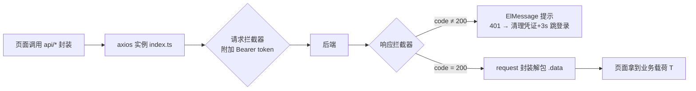
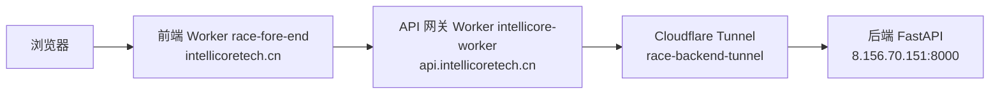

# 前端架构说明（fore-end）

> 版本：2026-08（Demo v1.8）· 对应 `e:\Project\Web\race\fore-end`
> 技术栈：Vue 3.5（`<script setup>` SFC）+ TypeScript + Vite + Element Plus + Pinia + Vue Router（Hash 路由）+ ECharts + Axios + Sass

本文档描述前端工程的分层结构、请求链路、状态管理、路由与部署，供开发与维护参考。

---

## 一、目录分层

```
src/
├── main.ts            # 入口：恢复登录会话后再挂载路由（避免守卫初始状态不准）
├── App.vue            # 根组件：路由切换顶部进度条
├── constants.ts       # 全局常量：应用名 / 版本号 / 本地存储键（统一维护）
├── api/               # 接口封装层（唯一允许直接发请求的地方）
│   ├── index.ts       # axios 实例：baseURL 分流 / JWT / 信封解包 / 401 统一处理
│   ├── auth.ts        # 登录 / 当前用户
│   ├── captcha.ts     # go-captcha 行为验证码
│   ├── risk.ts        # 动态评估 / 历史评估记录
│   ├── indicator.ts   # 指标树（单独放宽超时）
│   ├── dashboard.ts   # 数据看板统计
│   └── types.ts       # 与后端契约的类型定义
├── stores/            # Pinia 状态
│   ├── auth.ts        # 登录态（token / user / restoreSession）
│   └── risk.ts        # 评估结果 / 动态表单 / 原始表单快照
├── router/index.ts    # 路由 + 懒加载容错 + 登录守卫 + 导航菜单 NAV_MENUS
├── layouts/           # 布局（AppLayout：侧边栏 + 抽屉 + 顶栏 + 页脚）
├── views/             # 页面（Home / Login / DataInput / Result / Dashboard / Team）
├── components/        # 通用组件（DynamicField / MixedRatioSlider / RiskBadge / ScoreGauge / StatCard）
├── utils/             # 纯函数工具（validateIndicator 指标校验）
└── styles/            # 全局样式（Element Plus 主题色 + 通用类）
```

分层原则：

- **页面 → 状态 → 接口 → axios**：页面只依赖 `api/*` 的封装函数，不直接依赖 axios 实例；看板等页面数据统一走 `api/` 分层。
- **常量集中**：应用名、版本号、存储键集中在 `src/constants.ts`，各文件引用常量而非硬编码。
- **导航集中**：侧边栏 / 移动端抽屉共用 `router/index.ts` 导出的 `NAV_MENUS`，与路由 children 一一对应。

---

## 二、请求链路与信封解包

后端 FastAPI 业务接口统一返回信封 `{ code, message, data }`。处理流程：



- **baseURL 自动分流**：`*.workers.dev` 预览（dev 分支）→ `/dev/api/v1`；自定义域名 `intellicoretech.cn`（main 生产）→ `/api/v1`；`VITE_API_BASE_URL` 显式配置时优先。
- **类型契约**：`request.get<T>` / `post<T>` 返回 `Promise<T>`（业务载荷），类型与运行时一致。
- **错误处理**：业务 `code ≠ 200` 与 HTTP 层错误统一由拦截器提示；业务 401 与 HTTP 401 均清理凭证并 3 秒后跳转登录页（登录页自身失败不延迟）。
- **登录态恢复**：`main.ts` 在挂载前调用 `auth.restoreSession()`，仅在确认 token 失效（401）时登出，瞬时网络错误不清登录态。

---

## 三、状态管理（Pinia）

| Store | 职责 | 关键点 |
|---|---|---|
| `auth` | 登录态 | `login` 写入 token/user 到 localStorage；`restoreSession` 启动校验；`logout` 清理 |
| `risk` | 评估流程 | `riskResult` 结果、`dynamicForm` 提交表单、`formSnapshot` 原始表单快照；`assessDynamic` 返回布尔值（成功与否），由调用方决定是否跳转 |

本地存储键：`race_token` / `race_user`（见 `src/constants.ts`）。

---

## 四、路由与导航

- **Hash 路由**：`createWebHashHistory`，适配 Cloudflare Workers 静态资源部署（无需服务端回退）。
- **懒加载容错**：`lazyView()` 包装动态 import——chunk 加载失败 / 20s 超时自动刷新页面加载最新版本（最多 2 次，`sessionStorage` 计数防死循环），解决部署切换瞬间旧 chunk 404。
- **登录守卫**：`/input` `/result` `/dashboard` 需登录，未登录跳登录页并携带 `redirect` 回跳；已登录访问 `/login` 回首页。
- **页面标题**：`afterEach` 以「页面 - 应用名」拼接（应用名取 `src/constants.ts`）。

---

## 五、关键页面逻辑

| 页面 | 逻辑要点 |
|---|---|
| `Login` | 邀约制；点击登录弹出 go-captcha 行为验证码（click/slide/drag/rotate 四模式随机），校验通过后自动登录；`loginSubmitting` + `pendingCaptchaKey` 防重复提交与竞态 |
| `DataInput` | 勾选「具体营业类型」叶子（仅叶子可选，支持搜索）→ 聚合路径指标（大类→中类→小类→叶子，按 code 去重）；混合经营按叶子分配占比；提交前全量校验，评估成功才跳结果页；折叠面板默认展开、可手动收起 |
| `Result` | 评分仪表盘 / 风险等级 / 违约概率 / 授信建议 / 贡献图 / 前三项扣分；打印报告；历史记录（分页/查看/删除，查看加载结果快照）；贡献数据拷贝后排序，不修改共享状态 |
| `Dashboard` | 四个统计接口并行拉取；ECharts 图表随窗口 resize；移动端横向滑动 |

---

## 六、版本与发布

- 版本号集中在 `package.json` 与 `src/constants.ts`（`APP_VERSION`），页面徽标 / 打印报告引用常量，升级时两处同步即可。
- 发布流程：推送 `main` → Cloudflare Workers（`race-fore-end`）自动构建部署；`dev` 分支推送生成预览部署。
- 前端环境变量：见 `.env.example`（开发 `VITE_API_BASE_URL=/api/v1` 走 Vite 代理，生产按域名自动分流）。

---

## 七、部署架构



- 前端静态站：Worker `race-fore-end`（`wrangler.jsonc`，`assets.directory: ./dist`）
- API 网关：Worker `intellicore-worker`（`cloudflare/intellicore-worker/`，按 `/dev` 前缀分流 dev/main 后端，统一追加 CORS）
