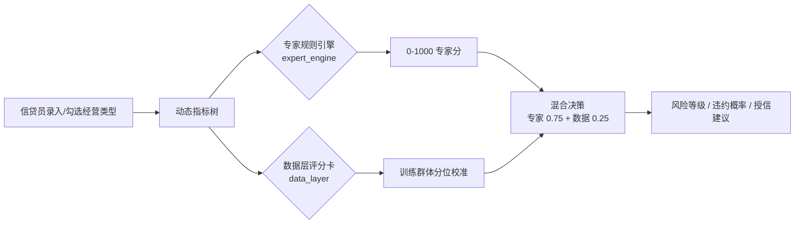
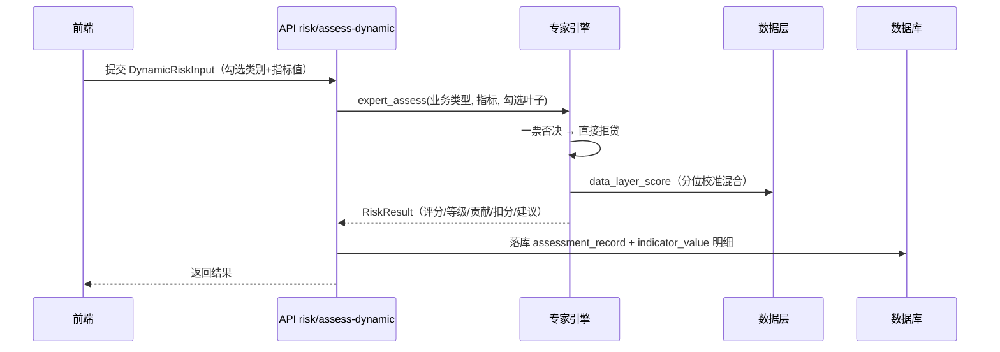

# 涉农信贷风控模型说明

> 版本：2026-08（Demo v1.9）· 对应 `back-end/app/ml/` 与 `back-end/app/services/risk_service.py`
> 系统现状：**专家规则引擎（生产主引擎）+ 多元统计评分卡（参考模型）+ 数据层评分卡（混合决策）**

本文档介绍系统的指标体系与指标判断逻辑、评分模型原理、模型训练流程、评估指标、以及线上评估链路，供开发、测试与答辩材料编写使用。

---

## 一、总体架构

系统采用「双引擎」评估架构：



- **专家规则引擎**（`expert_engine.py`）：不依赖历史违约样本，逐指标按「评分规则 + 建议权重」打分，可解释、可追溯，是当前生产环境的主引擎。
- **多元统计评分卡**（`scorecard.py`）：经典 Logistic 评分卡（IV 筛选 → WOE 编码 → VIF 诊断 → 回归），作为参考模型与演示基线。
- **数据层评分卡**（`data_layer.py`）：基于 CMES/CHFS 等数据集代理训练，仅在与专家分形成强信号时（训练群体分位极端）才参与混合，弱信号时保持专家分权威。

---

## 二、指标体系与指标判断

### 2.1 指标来源与层级

指标依据《农业及相关产业统计分类（2020）》与东北振兴区域涉农信贷场景编制，按**树形分层**组织。

- **搜集体系源文档**（`docs/农业及相关产业动态指标搜集体系.md`，共 3020 条）即完整版：基本项 37 + 大类 56 + 中类 183 + 小类 505 + 具体营业类型 2239，与生产指标树（`/api/v1/indicators/tree`）逐条一致（2026-08 核对）。

| 层级 | 说明 | 示例 |
| --- | --- | --- |
| 基本项 | 所有主体必填的通用信息（37 项） | 实际经营年限、年营业收入、资产负债率、银行信贷履约记录 |
| 大类（2 位码） | 01~10 十大农业及相关产业（56 项指标） | 01 农林牧渔业、02 食用加工与制造、05 流通服务… |
| 中类（3 位码） | 大类下的细分（183 项指标） | 011 农业生产、012 林业生产… |
| 小类（4 位码） | 中类下的细分（505 项指标） | 0111 谷物种植、0112 豆类油料… |
| 具体营业类型（叶子，`小类码_行业码`） | 最小可勾选经营单元（2239 项指标） | 0111_0111 稻谷种植、0111_0113 玉米种植… |

**录入方式**：信贷员在数据录入页勾选实际经营的「具体营业类型」（可多选、可搜索），系统自动加载该叶子及其路径上（大类 → 中类 → 小类 → 具体营业类型）的全部指标表单；未勾选、未填写的指标不参与计分。

### 2.2 指标字段与类型

每条指标在 `indicator_config` 表中含 14 列元数据（与搜集体系文档逐条一致），关键字段：

| 字段 | 含义 |
| --- | --- |
| `indicator_type` | 数值 / 枚举 / 布尔 / 文本 |
| `value_range` / `unit` | 取值说明与单位 |
| `scoring_rule` / `scoring_config` | 评分规则文本与可覆盖的评分参数（数值上限、档位映射等） |
| `weight_star` | 建议权重（1~5 星） |
| `is_feature` | 是否东北/寒地特色指标（黑土地、寒地、人参、冷水鱼等） |
| `is_veto` | 是否一票否决红线 |
| `data_source` / `cycle` | 数据来源与采集周期（年报/季报/月报/实时） |

### 2.3 指标判断规则（专家引擎逐指标打分）

单指标得分统一映射到 **0~100 分**，四类指标判断方式不同：

| 类型 | 判断逻辑 |
| --- | --- |
| **数值** | $score = clamp(\frac{value}{ref\_max},\ 0,\ 1) \times 100$。`ref_max` 取 `scoring_config.max` → 取值说明中的区间上限 → 默认 100；支持「越高越好」与「越低越好」（负债率、风险、频次类按评分规则/名称语义判定方向） |
| **枚举** | 优先按 `scoring_config.map` 档位映射；否则按选项语义关键词启发：含正面词（稳定/完整/无逾期/良好…）分高，含负面词（无/低/差/逾期/缺失…）分低，取选项相对位置线性插值 |
| **布尔** | 默认 是=100 / 否=40（`scoring_config.map` 可覆盖） |
| **文本** | 不参与评分（备注信息） |

> 缺失处理：未填写的指标直接剔除，权重在已填指标间重新归一化。

### 2.4 一票否决（授信红线）

`is_veto = true` 的指标（如：当前被列为失信被执行人、近两年重大税收违法、征信连三累六、实控人涉刑等）只要命中（取值 = 是/有/命中），**直接拒贷**：固定输出 `score=200 / probability=0.9 / 高风险 / 建议额度 0`，并在 `veto` 字段返回触发指标名，`overrides` 记录 `veto:{指标名}`。

---

## 三、专家规则引擎（生产主引擎）

### 3.1 权重模型

总分由「层级基础权重 × 层内星级归一 × 调整因子」三级构成：

1. **层级基础权重**（`business_type_config.level_weights` 可配，默认）：

   | 层级 | 基本项 | 大类 | 中类 | 小类 | 具体营业类型 |
   | --- | --- | --- | --- | --- | --- |
   | 权重 | 0.35 | 0.28 | 0.22 | 0.15 | 0.10 |

2. **层内星级归一**：同层级兄弟指标按星级分配，$w_i = \frac{star_i}{\sum_{同层已填} star_j}$，星级高的指标权重更大。

3. **调整因子**：特色指标 × 1.1 加成（可打破层级单调，如"小类特色指标 > 大类通用指标"为合法例外）；区域匹配加成预留（v1 占位）。

### 3.2 评分合成

$$score_{100} = \frac{\sum w_i \cdot s_i}{\sum w_i}, \qquad score = clamp(score_{100} \times 10,\ 0,\ 1000)$$

其中 $s_i$ 为单指标 0~100 分，$w_i$ 为三级权重合成后的有效权重。

### 3.3 等级分级与违约概率

| 评分区间 | 风险等级 | 授信策略 |
| --- | --- | --- |
| ≥ 700 | 低风险 | 优先审批，优惠利率 |
| 500 ~ 700 | 中等风险 | 审慎授信，可补充担保 |
| < 500 | 高风险 | 暂缓放贷 / 足额抵押 |

专家引擎违约概率采用校准逻辑映射：

$$p = \frac{1}{1 + e^{-(score - 550)/80}}$$

（评分 550 分对应 50% 违约概率，评分越高违约概率越低。）

### 3.4 混合经营加权

勾选多个大类时（`businessType = MIXED`）：

- 各子类型分别用专家引擎评估，再按勾选比例加权：
  $$score = \frac{\sum ratio_i \cdot score_i}{\sum ratio_i}$$
- **协同因子**（`business_type_config.MIXED.synergy_factors`）：当勾选组合命中已知协同组合（如 01+02 种植+食用加工·产销一体 ×1.06、01+04 种植+生产资料 ×1.04 等）时，取**最大一个**协同加成：$score = clamp(score \times factor, 0, 1000)$（v1 不叠加多个因子，避免过度乐观）。
- 贡献度按比例缩放，扣分原因取合并后最低分前三项。

### 3.5 数据层混合决策

当提交指标中含数据层已知特征（实际经营年限、从业人员数等）≥ 2 项且有已注册数据层模型时：

- 数据层模型预测分映射到**训练群体风险分位**；
- 分位 ≤ 0.15（最差 15%）→ 独立高风险警报，较强下修（$0.5 \times 专家 + 0.5 \times 数据$）；
- 分位 ≥ 0.85（最优 15%）→ 确认低风险，轻度上修（$0.9 \times 专家 + 0.1 \times 数据$）；
- 中间带 → 保持专家分权威（弱模型不稀释区分度）。

数据层不可用 / 特征不足 / 无强信号时**静默降级为纯专家分**，不影响主流程。

### 3.6 授信额度与利率

- **基准额度**：默认 5 万元；若填有营收类指标（营业收入/年产值等），取 $\max(营收 \times 0.8,\ 5)$。
- **等级折扣**：低风险 ×1.0，中等 ×0.7，高风险 ×0.4。
- **利率**：$rate = 3.5 + (1 - score/1000) \times 6.0$（3.5%~9.5%）。

---

## 四、多元统计评分卡（参考模型）

经典评分卡流程，对齐商业计划书 3.3.1 技术路线：


### 4.1 样本生成（`seed.py`）

- 模拟黑龙江涉农经营主体 **15 项指标**（四大维度），按真实分布生成：确权面积/营收右偏（对数正态）、投保年限左偏、流转年限离散等；
- 违约标签由数据生成过程（DGP）驱动：信用好的样本各指标整体更优，违约率 3%~5%；
- 固定随机种子 42，跨环境完全可复现。

### 4.2 特征工程

- **WOE 分箱**（`binning.py`）：连续变量分位数初分箱 → 合并低频箱 → 坏账率单调性校正；分类变量按类别计算 WOE，稀有类别合并为「其他」；缺失单独成箱。$WOE = \ln(\frac{good\_dist}{bad\_dist})$，$IV = (good\_dist - bad\_dist) \times WOE$。
- **SMOTE**：在**原始特征空间、分箱之前**对训练集过采样（分类列 ordinal 编码插值后取最近类别），避免对 WOE 后数据插值影响边界稳定性。
- **IV 筛选**：剔除 $IV < 0.02$ 的变量；若全部过低，兜底保留 IV 最高的 3 个。
- **VIF 诊断**：逐步剔除 $VIF > 10$ 的变量（最多 20 轮）。

### 4.3 评分刻度

$$B = \frac{PDO}{\ln 2} \approx 72.13 \ (PDO=50)$$

$$Score = A - B \cdot \ln\left(\frac{p}{1-p}\right) = A - B \cdot logit$$

- 基准分 $A = base\_score + B \cdot \sum_i coef_i \cdot \overline{WOE}_i$（使样本平均分落在 600 分附近，对齐行业惯例 A=600）；
- 每指标贡献分 $pts_i = -B \cdot coef_i \cdot (WOE_i - \overline{WOE}_i)$，各贡献分之和 + 600 = 总分；
- 预测分 $= clamp(A - B \cdot logit,\ 0,\ 1000)$，违约概率 $p = \frac{1}{1 + e^{-logit}}$。

### 4.4 模型评估

在**测试集**上用训练集分箱器转换（防数据泄漏）评估，业务阈值按「评分 < 500 视为预测违约」映射回概率阈值：

| 指标 | 含义 | 说明 |
| --- | --- | --- |
| AUC | 区分度 | ROC 曲线下面积 |
| KS | 最大区分度 | $max(TPR - FPR)$ |
| Precision / Recall / F1 | 精确率 / 召回率 / F1 | 按业务阈值计算（避免类不平衡下 bestThreshold 失真） |
| Accuracy | 准确率 | 同上 |
| 5 折 CV AUC | 稳定性 | StratifiedKFold 交叉验证 |
| PSI | 群体稳定性 | 训练集 vs 测试集评分分布偏移（<0.1 稳定） |

### 4.5 三组对比实验（`experiments.py`，对齐计划书 3.3.3）

统一使用 70/30 分层划分 + Logistic 基模型，保证可比性：

1. **实验一**：替代数据指标体系有效性 —— 替代数据（土地/补贴/保险类）vs 传统信用数据（产销经营中的财报征信类）；
2. **实验二**：特征工程方案对比 —— 原始变量 / WOE 编码 / 分组 PCA；
3. **实验三**：涉农专属模型 vs 通用风控模型（通用模型仅用传统指标）。

---

## 五、模型训练与部署

### 5.1 训练编排（`training.py` / `scripts/train_model.py`）

```bash
# 命令行训练（默认 3000 条合成样本）
python scripts/train_model.py
python scripts/train_model.py 5000   # 指定样本量
```

`run_training` 流程：读取/生成样本 CSV → `Scorecard.fit`（分箱→IV→VIF→Logistic→评分刻度）→ 三组对比实验 → 保存产物到 `data/models/scorecard_{version}.pkl` → 注册模型版本（`model_version` 表，旧 active 版本自动置为 inactive）。

- 服务启动时若无可加载模型，自动用合成样本训练（`AUTO_TRAIN_ON_STARTUP`）。
- 管理平台「模型训练」接口与命令行共用同一编排。
- 数据层模型通过 `scripts/train_data_layer.py` 训练并注册（`model_type=data_layer`）。

### 5.2 模型产物与版本管理

| 项 | 说明 |
| --- | --- |
| 产物目录 | `data/models/`（`scorecard_{version}.pkl`，pickle） |
| 版本注册 | `model_version` 表：AUC/KS/PSI/样本量/特征数/产物路径/训练人 |
| 激活模型 | 优先 DB 中 `status=active` 的版本，其次最新产物文件 |

### 5.3 线上评估链路



- 评估记录落库（`assessment_record`）：输入快照 `input_json`、结果快照 `result_json`、动态指标明细 `indicator_value`、归属 `user_id`/`assessor_name`、数据完整度等。
- **数据完整度** `completeness`：相对期望指标集（基本项 + 大类 + 勾选叶子路径上的各级指标）计算已填比例，0~1。

---

## 六、输出结果字段（RiskResult）

| 字段 | 类型 | 说明 |
| --- | --- | --- |
| `score` | int | 综合信用评分 0-1000 |
| `probability` | float | 违约概率 0-1 |
| `level` | string | 低风险 / 中等风险 / 高风险 |
| `suggestedAmount` | float | 建议授信额度（万元） |
| `suggestedRate` | float | 建议利率（%） |
| `contributions` | list | 各指标贡献（factor/category/weight/score） |
| `deductions` | list | 前三项扣分原因 |
| `advice` | string | 信贷建议文本 |
| `overrides` | list | 触发的兜底/混合规则（data_layer/synergy/veto 等） |
| `veto` | string \| null | 一票否决命中指标名 |
| `completeness` | float | 数据完整度 0~1 |

---

## 七、代码位置速查

| 模块 | 文件 |
| --- | --- |
| 专家规则引擎 | `back-end/app/ml/expert_engine.py` |
| 数据层混合 | `back-end/app/ml/data_layer.py` |
| 多元统计评分卡 | `back-end/app/ml/scorecard.py` |
| WOE 分箱 / IV | `back-end/app/ml/binning.py` |
| 模型评估 | `back-end/app/ml/evaluate.py` |
| 三组对比实验 | `back-end/app/ml/experiments.py` |
| 样本生成 | `back-end/app/ml/seed.py` |
| 训练编排 | `back-end/app/ml/training.py`、`scripts/train_model.py` |
| 模型持久化 | `back-end/app/ml/model_artifact.py` |
| 15 项指标定义 | `back-end/app/ml/indicators.py` |
| 评估落库服务 | `back-end/app/services/risk_service.py` |
| 指标体系文档 | `fore-end/docs/农业及相关产业动态指标搜集体系.md` |
